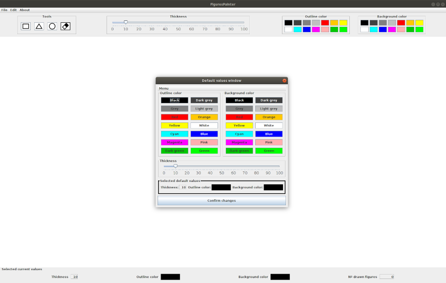
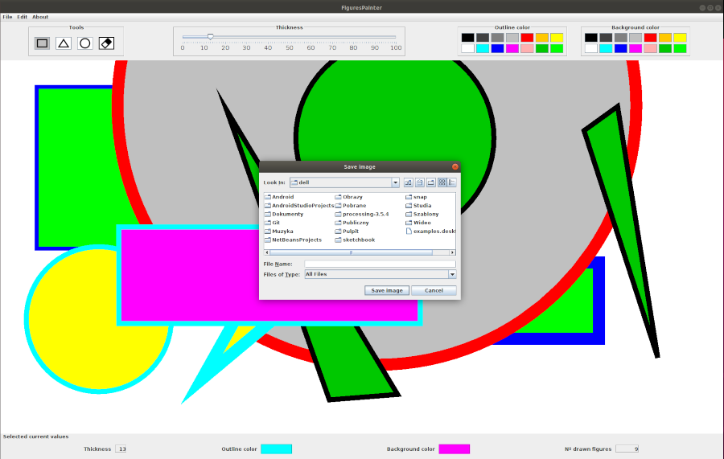
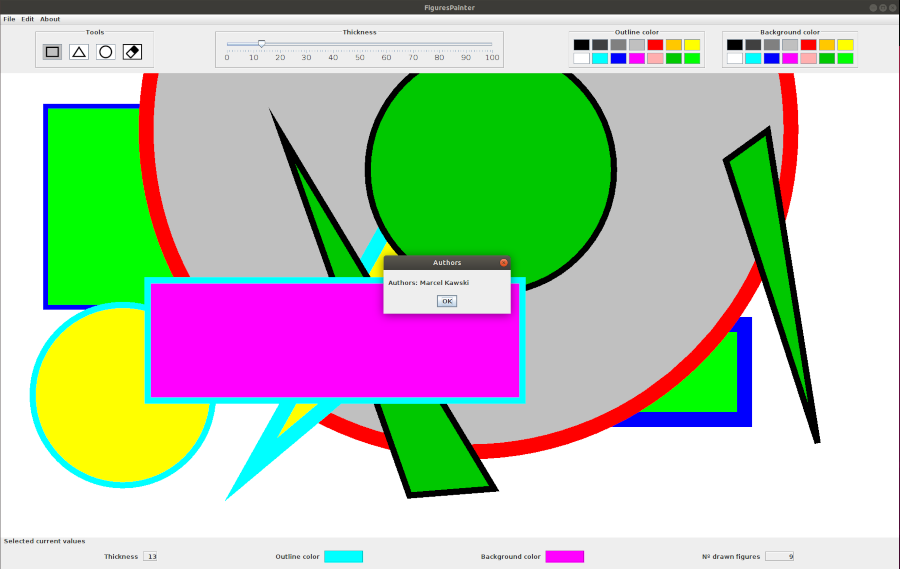
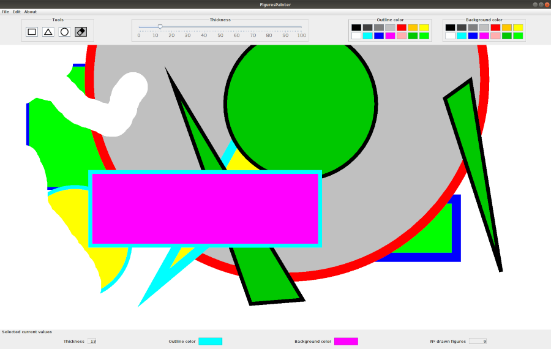

# FiguresPainter
Interactive application for drawing figures

## Table of contents
* [General info](#general-info)
* [Screenshots](#screenshots)
* [Technologies](#technologies)
* [Features](#features)
* [Instruction](#instruction)

## General info
Final project for the subject Human Computer Interaction on the Universitat de Valencia during my Erasmus+ exchange. The project was made to show all my skills I learned during the course including MVC software design pattern, Swing, AWT, events handling and use of listeners.

## Screenshots

## Technologies
* Java - version 13.0.1
* Swing
* AWT

## Features
* drawing figures (rectangles, triangles, circles)
* erasing drawn figures
* changing colors of outline and color of background of figures
* changing thickness of outline
* changing default values of color of outline, color of background and thickness of outline
* setting current values of color of outline, color of background and thickness of outline to default
* controlling set values on the panel showing current color of outline, color of background and thickness of outline
* saving drawn image
* displaying the author of the project

## Instruction
**Drawing rectangles**\
To draw a rectangle you need to click the mouse on the spot you want to start your rectangle and drag it to the spot you want your rectangle to end (the beginning and end of the rectangle are opposite vertices of the rectangle).

**Drawing triangles**\
To draw a triangle you need to click the mouse thrice in spots you want 3 vertices of your traingle to be located.

**Drawing circles**\
To draw a circle you need to click the mouse in the spot you want to have the centre of your circle and drag it to the spot you want your circle to end (by dragging the mouse you adjust the radius of the circle).

